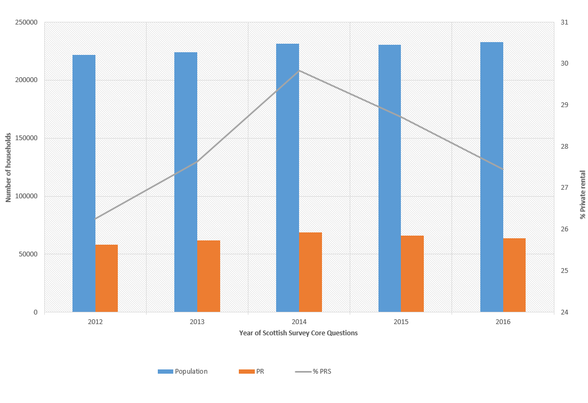
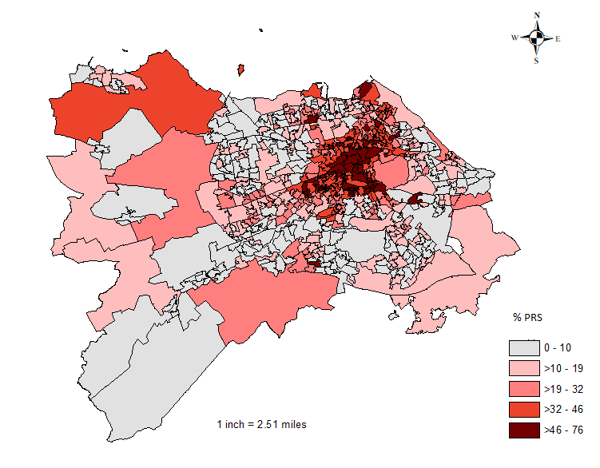
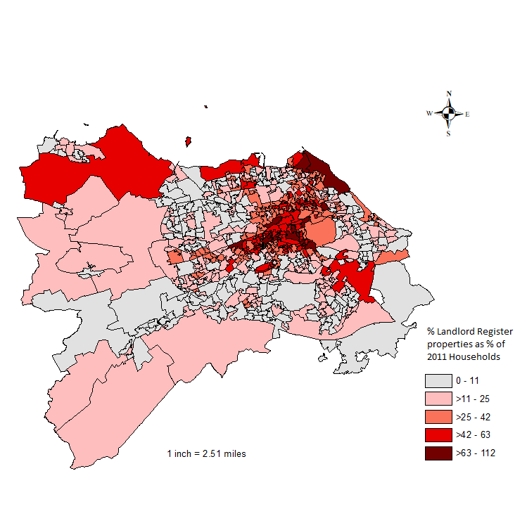

```{r setup, include=FALSE}

# global options for knit
knitr::opts_chunk$set(fig.width=8, fig.height=6, fig.path='Figs/',
                      echo=FALSE, include=FALSE, warning=FALSE, message=FALSE)

# install packages - first time only
# packs <- c("tidyverse", "dplyr", "readxl")
# install.packages(packs)

# load libraries
library(dplyr)
library(tidyverse)
library(readxl)

```

<br><br>

# Introduction

Data were obtained from City of Edinburgh Council's register of private landlords. Data were obtained under a Freedom of Information (FoI) request in December 2017. (The request was made on 07/09/2017 - request number 16177). These data provide the number of listed properties within each unit postcode in the city at that time, i.e. they are an aggregated, anonymised extract from the database. In this note, we explore how these data can be used to provide a picture of private renting in the city. 

Similar Data Notes have been produced with extracts from the landlord registers for Aberdeen and Renfrewshire councils. 

<br><br>

# Census and survey data on the PRS in Edinburgh

Some data on the PRS in Edinburgh is available from the Census and from household surveys. The Census is now somewhat out of date while the latter can only provide reliable estimates at local authority level. 

At the 2011 Census, there where 224,240 households in Edinburgh, of which 49,980 (22.3%) were in the private rented sector(PRS). We can estimate changes since then using the Scottish Survey Core Questions (SSCQ) for 2012-16 (Figure 1). This shows a rise households number and in private renting, although the latter appears to have peaked in 2014. In 2016, there were an estimated 232,900 households in the city - an increase of 3.9% from 2011. The number of households in private renting rose to a peak of nearly 70,000 in 2014 but fell in subsequent years to 63,920 in 2016 (27.4%). That figure is still 28% higher than the Census estimate. <br><br>


#### Figure 1: Private renting in Edinburgh - SSCQ 2012-16


[Mark - can we update to 2017? number and % PRS in 2012 (assuming 2011 not available) and number/% in 2017. And include 2011 Census estimate?]

<br><br>

# Landlord register dataset
```{r get FOI data}
# open csv file from FoI request
df_foi <- as_tibble(read_excel("data/16177 Response Data.xlsx"))

# rename cols to remove spaces
names(df_foi) <- c("PropertyPostcode", "NumberOfProperties")

# make id column from row number
df_foi <- tibble::rowid_to_column(df_foi, "ID")

# make pc8 as uppercase version of original - name to match var in pcode lookup
df_foi <- mutate(df_foi, 
                 pc8 = toupper(PropertyPostcode))
       
# this shows that first two letters in pc8 are always EH
table(str_sub(df_foi$pc8, 1, 2))

# this shows that length of pc8 mostly 7 or 8, but one 9
table(str_length(df_foi$pc8))

# identify the case - "EH16 4 FE"
subset(df_foi, str_length(pc8) > 8)

# change that case
df_foi$pc8[df_foi$pc8 == "EH16 4 FE"] <- "EH16 4FE"

# check that it is fixed
table(str_length(df_foi$pc8))

# quick check on final state of df_foi
head(df_foi)

```

Data were provided as a .csv file, listing each unit postcode containing any registered properties and the number of registered properties. It should be noted that, where a property is owned by two or more individuals, each is required to register separately. In this dataset, duplicate listings for the same property have been combined. (This is different to the treatment in the Aberdeen note where the data were provided as the number of listings. The Renfrewshire note gives some insights into the difference which results.) 

Various checks were carried out on the postcodes. All begin with "EH" as expected. All but one has the expected 7 or 8 characters. The exception had 9 characters due to an additional space so is easily corrected. However, it is surprising that the system does not seem to check and prevent an obviously invalid postcode from being entered. 

In total, there are `r nrow(df_foi)` postcodes with registered properties and they contain a total of `r format(sum(df_foi$NumberOfProperties), digits=4, scientific=FALSE)` properties. That represents an average of `r signif(sum(df_foi$NumberOfProperties)/nrow(df_foi), digits=2)` properties per postcode. The maximum number is `r max(df_foi$NumberOfProperties)`. Figure 2 shows the distribution with very few unit postcodes having more than about 30 registered properties. Note that postcodes with no properties are omitted.  <br><br>


```{r histogram FOI data, include=TRUE}
# histogram of No. or Reg Props
ggplot(data = df_foi, 
       mapping = aes(x = NumberOfProperties)) +
  geom_histogram() +
  ggtitle("Figure 2: Number of registered properties per postcode - Edinburgh") +
  theme(plot.title = element_text(size = 14, face = "plain")) +
  xlab("Number of Registered Properties in Postcode") +
  ylab("Number of Postcodes")
```


The number of registered properties is `r signif(100 * sum(df_foi$NumberOfProperties)/63920, 3)`% of the estimated total for Edinburgh (using the SSCQ figure from 2016). At best, there appear to be `r format(100 - (100 * sum(df_foi$NumberOfProperties)/63920), digits=3, scientific=FALSE)`% of properties not listed (around `r signif(63920 - sum(df_foi$NumberOfProperties), digits=4)` properties). That figure is almost certainly an underestimate since properties can be listed but not let. Nevertheless, it suggests a very high coverage overall. <br><br>

# Comparison of landlord register with Census

The great advantage of the landlord register data is that it provides detail down to the small area level. Here we aggregate data from unit postcodes to Datazones, and then use these to compare with Census data for the same units. 

We do not expect a perfect fit between these data for two reasons. The first is the difference in timing of around six years) during which time the sector will have grown faster in some locations than others. The second is that we do not expect all rented properties to be registered, nor all registered properties to be rented. Nevertheless, given the high ratio of registered properties to households in the PRS, we would expecta strong the relationship between the two. 


```{r get pcode lookup}

# open postcode directory - gives some errors which we ignore for now
# NB that to fit onto GitHub, have had to cut down to EH pcodes only but left
#    code unchanged so assumes it is whole of Scotland
df_pcode <- read_csv(
  "data/Scottish_Postcode_Directory_2017_2 (EH).csv",
  col_types = cols(
      pc7 = col_character(),
      pc8 = col_character(),
      Grid_Reference_Easting = col_double(),
      Grid_Reference_Northing = col_double(),
      Latitude = col_double(),
      Longitude = col_double(),
      DataZone2011 = col_character(),
      HHC2011 = col_double(),
      Pop2011 = col_double(),
      HHC2001 = col_double(),
      Pop2001 = col_double()
  )
)

# cut df_pcodes to "EH"" and only the vars we need to attach to foi data
df_pcode2 <- subset(df_pcode, str_sub(pc7, 1, 2) == "EH",
                   select = c(pc7, pc8, DataZone2011, LAU_Level1_2011
                   )
)
# add data from df_pcode2 to df_foi
df_foi <- df_foi %>%
  left_join(df_pcode2, by = "pc8")
# check how many cases have missing values - for pc7 it is 18 
sum(is.na(df_foi$pc7))
# check number of rows and valid cases in all cols
# NB there is some drop off in HHC and Pop figs, esp. for 2001
nrow(df_foi)
colSums(!is.na(df_foi))
# aggregate foi data to DZ level, summing number of registered props
df_foi_dz <- df_foi %>%
  group_by(DataZone2011) %>%
  summarise(
    NumberOfProperties = sum(NumberOfProperties, na.rm = TRUE)
    )

# second cut of df_pcode to those in Edinburgh in order to make list of DZs in city 
df_pcode3 <- subset(df_pcode, LAU_Level1_2011 == "S30000008",
                   select = c(DataZone2011
                   )
)
# collapse so it is just a list of DZs in Edinburgh
df_dz_Edin <- df_pcode3 %>%
  group_by(DataZone2011) %>%
  summarise()
# also extract as list
dz_Edin <- (df_dz_Edin$DataZone2011)

# Open census data file with tenure composition for DZs in 2011
df_census <- as_tibble(read_csv("data/tenure DZ2011.csv"))
# make correct PRS and PRSPct figures
df_census <- mutate(df_census, 
                    PRS = PrtRent_2011, 
                    PRSPct = PrtRent_2011/All_HH_2011)
# reduce to DZs in Edinburgh using the list - dz_Edin
df_census <- df_census[df_census$DataZone %in% dz_Edin,]
# rename 'Datazone' as 'Datazone2011' for matching
colnames(df_census)[1] <- "DataZone2011"

# merge census tenure and foi data on to the Edinburgh Datazones file. 
df_dz_Edin <- df_dz_Edin %>%
  left_join(df_census, by = "DataZone2011")
df_dz_Edin <- df_dz_Edin %>%
  left_join(df_foi_dz, by = "DataZone2011")

# check number of DZ and number with registered properties
nrow(df_dz_Edin)
sum(is.na(df_dz_Edin$NumberOfProperties))

# where reg props missing for any DZ, set to zero
df_dz_Edin$NumberOfProperties[
  is.na(df_dz_Edin$NumberOfProperties)
  ] <- 0
```
To aggregate unit postcodes to Datazones, we use a lookup file. In this process, the lookup failed in `r sum(is.na(df_foi$pc7))` cases - a very small fraction. There are `r nrow(df_dz_Edin)` Datazones in Edinburgh in 2011 and `r nrow(df_foi_dz)` of these have registered landlords in 2017. 
```{r correlation}
# make text for correlation
corr <- signif(
  cor(df_dz_Edin$PRS, df_dz_Edin$NumberOfProperties), 
  digits = 2)
corr_text <- paste("R =", corr)
```


A scatterplot shows the relationship between the number of properties in the PRS according to the Census 2011 and the number of registered properties in 2017 (Figure 3). Overall, the correlation is very high (`r corr_text`). The solid line is the line of equality while the dashed line shows the exected number of registered properties in each case (given the number of registered properties compared with the number recorded by the Census). There are a few points some way below the line but more some way above it, suggesting that these are locations where private renting has been growing most strongly.  <br><br>


```{r graphs, include=TRUE}

# 'expected' line given number of llord register (sum(df_foi$NumberOfProperties))
# and number at Census (49980)
expected_slope <- sum(df_foi$NumberOfProperties)/49980

ggplot(data = df_dz_Edin, 
       mapping = aes(x = PRS, y = NumberOfProperties)) +
  geom_point() +
  ggtitle("Figure 3: Registered properties in 2017 vs PRS households in 2011 - Edinburgh") +
  xlab("PRS households in 2011 (Census)") +
  ylab("No. of registered properties in 2017") +
  theme(plot.title = element_text(size = 14, face = "plain")) +
  geom_abline(slope=1) +
  geom_abline(slope=expected_slope, linetype = "dashed") +
  geom_text(x = 25, y = 450,
            label = corr_text)

```


We can get more insights by mapping the PRS at is was in 2011 (Figure 4) and comparing with the change 2011-17 (Figure 5). Figure 4 confirms the high concentration of the sector in the older inner areas where it ranged between 46% and 76%. There were also relatively high concentrations in a number of suburban locations to the west and south east of the city.The fastest growing areas tend to be just around the central core, in the locations where the PRS was not quite at such a high level in 2011. There was also faster growth in some of the suburban locations to the west of the city. <br><br>

#### Figure 4: Households in PRS - 2011
 
<br>

#### Figure 5: Percentage change in households in PRS - 2011-17


